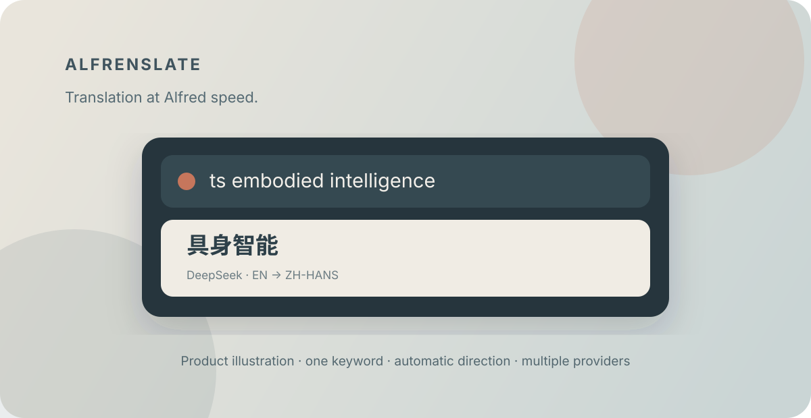

<p align="center">
  
</p>

# Alfrenslate

**Translation at Alfred speed.**

Alfrenslate is a native Alfred 5 workflow for fast, private-by-design translation across the providers you choose. Remember one keyword—`ts`—and compare several translations without leaving Alfred.

```text
ts embodied intelligence  →  具身智能
ts 多模态智能体           →  multimodal agent
```

[Download the latest release](https://github.com/qinchonghanzuibang/Alfrenslate/releases/latest) · Requires **Alfred 5 with the Powerpack**

## Why Alfrenslate

- One everyday keyword. Chinese input goes to natural English; English and other languages go to Simplified Chinese.
- Seven first-class providers, with concurrent requests and deterministic result ordering.
- Provider choice stays with you. Enable one provider or compare several.
- Native arm64 and x86_64 macOS binaries. No Python, Node.js, Homebrew package, or separate runtime is required after installation.
- No Alfrenslate server, telemetry, or usage analytics.

## How it works

Alfrenslate analyzes Unicode locally. It ignores technical noise such as URLs, paths, punctuation, code symbols, numbers, and emoji, then combines Chinese character count, Latin-letter count, Chinese ratio, and contiguous Chinese spans. This direction decision is shared by every enabled provider; source-language detection remains automatic at the provider.

All ready providers run concurrently. Successful translations appear first in your configured provider order, followed by individual, actionable failures. A slow or unavailable provider does not hide successful results from the others.

## Installation

1. Open [GitHub Releases](https://github.com/qinchonghanzuibang/Alfrenslate/releases).
2. Download `Alfrenslate.alfredworkflow`.
3. Double-click it to import the workflow into Alfred.
4. Confirm that you have Alfred 5 with the Powerpack.
5. Open Workflow Configuration and enable at least one configured provider.
6. Type `ts hello` in Alfred.

Configuration lives at:

```text
Alfred Settings
→ Workflows
→ Alfrenslate
→ Configure Workflow
```

## Configure a provider

Only enabled providers are called. Credentials remain in your local Alfred Workflow Configuration.

### DeepSeek

Enable **DeepSeek**, enter the API Key, and normally keep the default Base URL and Model. The defaults use the official `https://api.deepseek.com` OpenAI-compatible endpoint and the low-latency non-thinking `deepseek-v4-flash` model. Both fields remain editable for future models. See the [DeepSeek API documentation](https://api-docs.deepseek.com/).

### OpenAI-Compatible

Enable **OpenAI-Compatible**, enter a Base URL and Model, then enter an API Key if your service requires one. Local services without authentication may leave the key empty. Both forms below are accepted and normalized without duplicating `/v1` or `/chat/completions`:

```text
https://api.example.com/v1
https://api.example.com/v1/chat/completions
```

This provider works with services exposing compatible Chat Completions APIs, including OpenRouter, SiliconFlow, vLLM, Ollama compatibility endpoints, and LM Studio. Compatibility still depends on the selected service and model.

### DeepL

Enable **DeepL**, enter the API Key, and set API Tier to `free` for a Free key or `pro` for a Pro key. Choose `custom` and enter Custom Base URL only for a proxy or compatible endpoint. Alfrenslate uses DeepL's current JSON POST API and sends credentials in the authorization header. See the [DeepL translate reference](https://developers.deepl.com/api-reference/translate/request-translation).

### Youdao

Enable **Youdao**, enter App Key and App Secret, and choose a Domain: `general`, `computers`, `medicine`, `finance`, or `game`. Specialized domains require matching service access and currently focus on Chinese–English translation. See the [Youdao text translation documentation](https://ai.youdao.com/DOCSIRMA/html/trans/api/wbfy/index.html).

### Baidu

Enable **Baidu**, then enter the App ID and App Secret from Baidu Translate Open Platform. See the [Baidu General Text Translation documentation](https://fanyi-api.baidu.com/doc/21).

### Google

Enable **Google** and enter a Google Cloud Translation API Key. The Cloud Translation API must be enabled in the key's Google Cloud project. Alfrenslate uses Cloud Translation Basic v2, not an unofficial web endpoint. See the [Google v2 translate reference](https://cloud.google.com/translate/docs/reference/rest/v2/translate).

### Microsoft

Enable **Microsoft Translator**, enter the Azure Subscription Key, the Region when required by your resource type, and the Endpoint. The standard endpoint is prefilled. See the [Microsoft Translator v3 reference](https://learn.microsoft.com/en-us/azure/ai-services/translator/text-translation/reference/v3/translate).

## Supported providers

| Provider | Authentication | Targets |
|---|---|---|
| DeepSeek | API Key | Simplified Chinese, English |
| OpenAI-Compatible | Optional Bearer key | Simplified Chinese, English |
| DeepL | API Key; Free/Pro/Custom tier | `ZH-HANS`, `EN-US` |
| Youdao | App Key + App Secret, v3 SHA-256 | `zh-CHS`, `en` |
| Baidu Translate | App ID + App Secret, MD5 signature | `zh`, `en` |
| Google Cloud Translation | API Key | `zh-CN`, `en` |
| Microsoft Translator | Subscription Key + optional Region | `zh-Hans`, `en` |

## Usage

Type `ts`, a space, and the text:

```text
ts embodied intelligence
ts 这个实验结果支持我们的主要结论
```

Every successful item contains the translation as its title and argument. The subtitle identifies provider, detected source, target, latency, or cache status.

### Advanced usage

Automatic direction is the normal experience. Force a target only when needed:

```text
ts --to zh Your text
ts --to en 你的文字
ts -t zh Your text
ts -t en 你的文字
```

Unsupported parameters produce an actionable Alfred error item.

## Keyboard actions

- **Enter** copies the translation.
- **Command + Enter** shows it with Alfred Large Type.
- **Option + Enter** copies it and attempts to paste into the frontmost application.

Automatic paste uses macOS Accessibility. Allow Alfred at **System Settings → Privacy & Security → Accessibility**. Some applications block synthetic paste; the translation is still placed on the clipboard first.

## Universal Action

Select text in any application, open Alfred's Universal Actions, and choose **Translate with Alfrenslate**. It uses the same local direction detection and configured provider comparison as `ts`.

## Provider management

Type `alfrenslate` to:

- inspect version and configuration status;
- test every enabled provider or one provider;
- clear the local translation cache;
- open Workflow Configuration, diagnostics, the repository, Releases, or this documentation.

Status text is restricted to Enabled/Disabled, Configured/Missing credentials, and Reachable/Failed. Credentials are never displayed. Provider tests send a small real translation request and can consume quota.

Provider order, request timeout, retry count, cache enablement, and cache lifetime are configurable in Workflow Configuration.

## Privacy

Alfrenslate has no backend server. It collects no telemetry and no usage analytics. Translation text travels directly from your Mac to each third-party provider you enable; review those providers' privacy policies before use.

Credentials are stored locally by Alfred in Workflow Configuration. If caching is enabled, translations can be stored in Alfred's local cache directory. Credentials are never included in cache keys or cache files. Disable **Enable local cache** in Workflow Configuration or use `alfrenslate` → **Clear local translation cache**. Alfrenslate never uploads its local cache to an Alfrenslate-operated service.

## Troubleshooting

- **No provider is enabled:** enable one provider and complete its required fields.
- **Authentication failed:** rotate or re-enter the key and check endpoint/tier/region settings.
- **Endpoint or model not found:** verify the full compatible URL and exact model ID.
- **Rate limit or quota exceeded:** wait, adjust provider quota, or temporarily disable that provider.
- **DeepL tier mismatch:** Free keys use `free`; Pro keys use `pro`.
- **Paste does not occur:** grant Accessibility permission; the clipboard should still contain the result.
- **Local service unavailable:** confirm it is running and its URL is reachable from macOS.

Run `alfrenslate` in Alfred for local diagnostics. Errors and logs are credential-redacted; debug logging is off by default and does not record full queries or translations.

## Contributing

See [CONTRIBUTING.md](CONTRIBUTING.md) for architecture, development commands, mock testing, packaging, and optional live tests. Security reports belong in the private channel described in [SECURITY.md](SECURITY.md).

## Acknowledgements

The single-keyword interaction was inspired by [alfred-translate-it](https://github.com/yinan-c/alfred-translate-it). Alfrenslate is a clean-room, independent implementation; no reference-project code, workflow definition, documentation text, icon, screenshot, or other asset was copied.

Alfrenslate is an independent community project and is not affiliated with or endorsed by Alfred or Running with Crayons Ltd.

## License

[MIT](LICENSE) © Chonghan Qin
